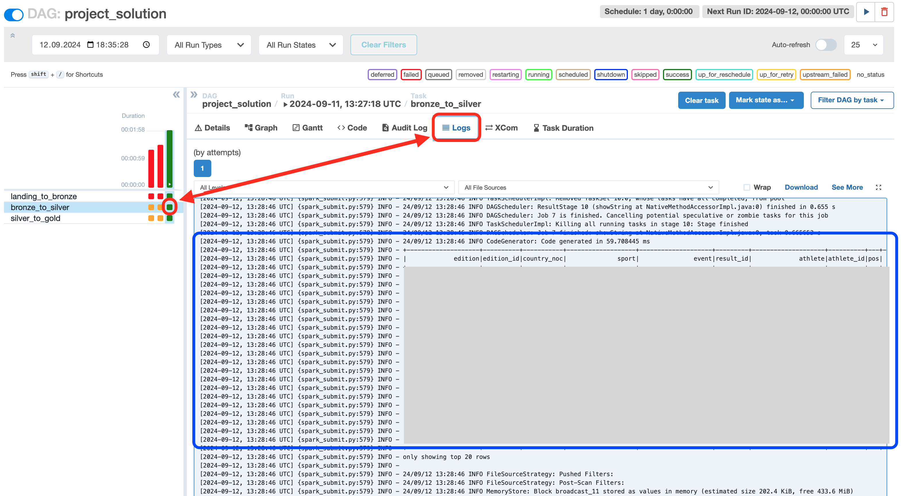
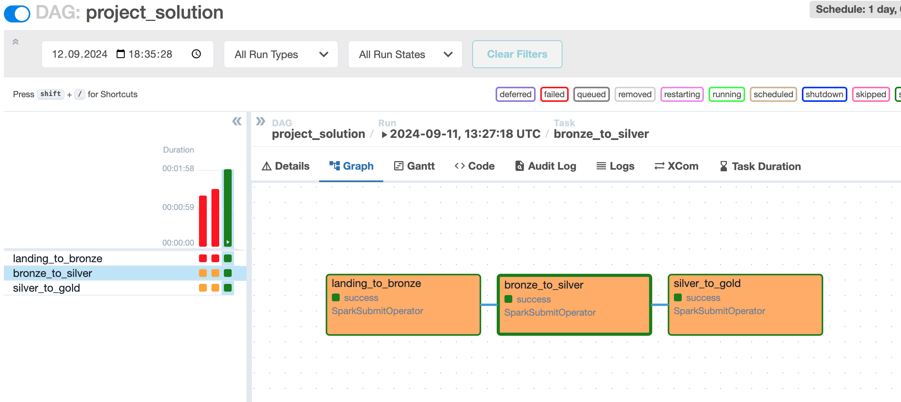
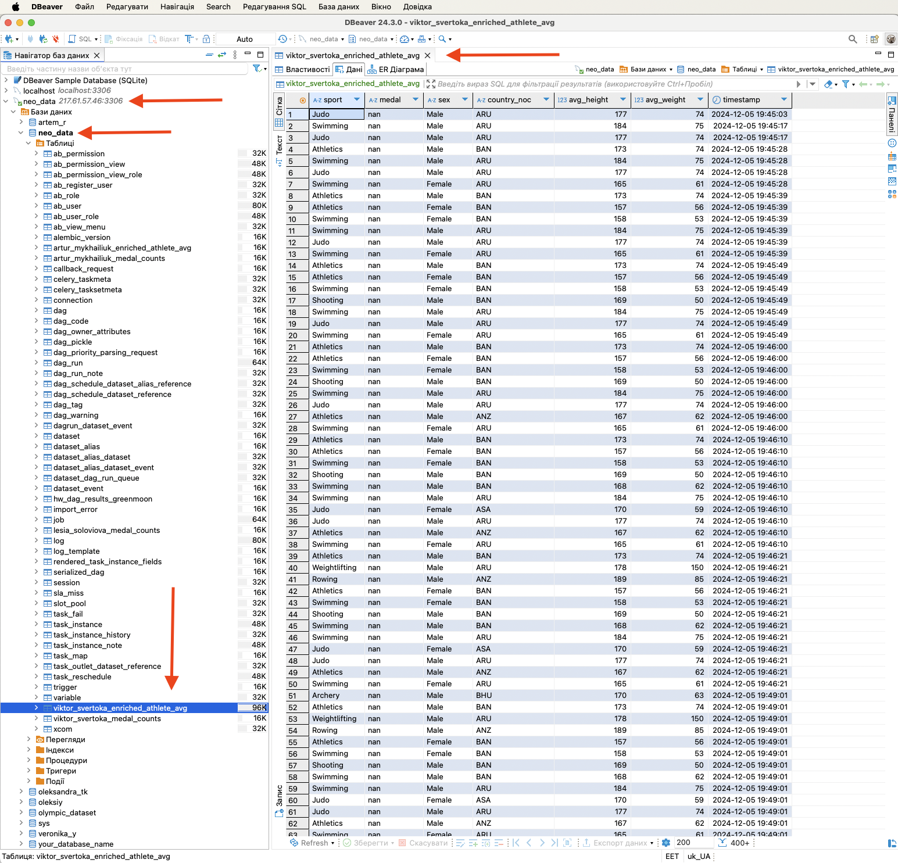
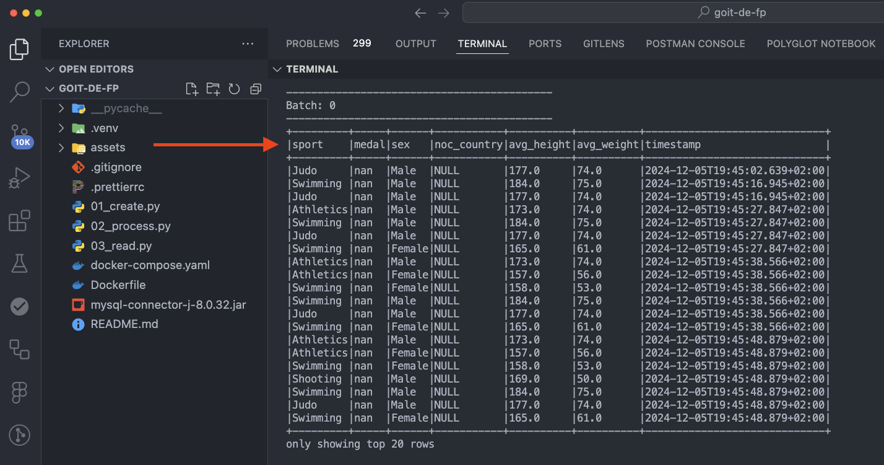
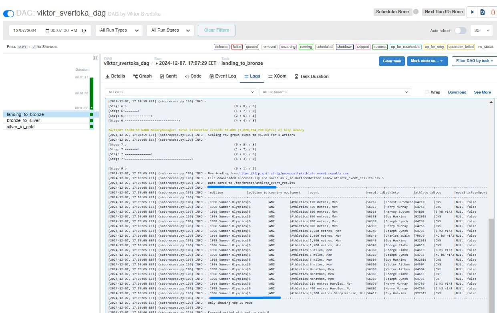
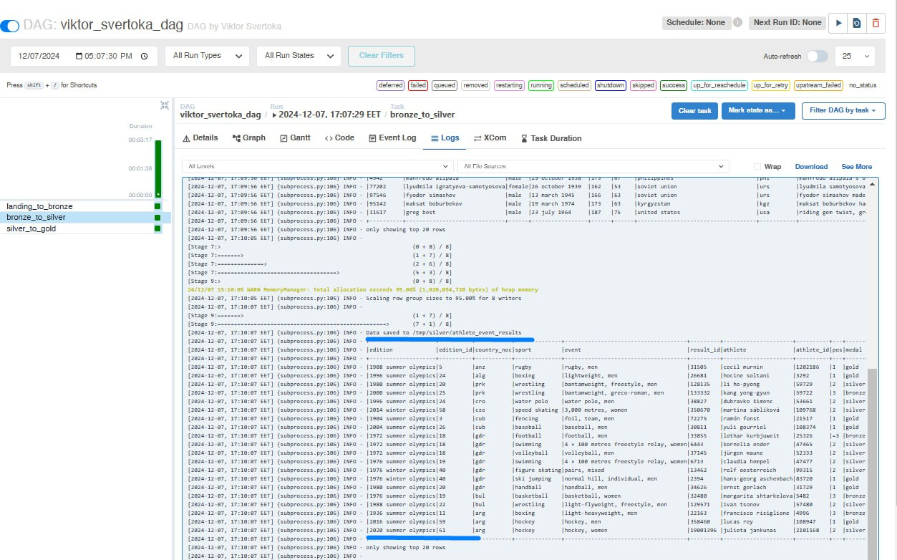
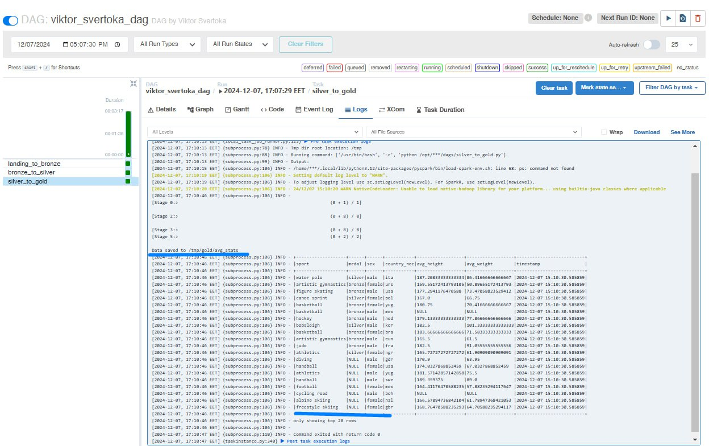
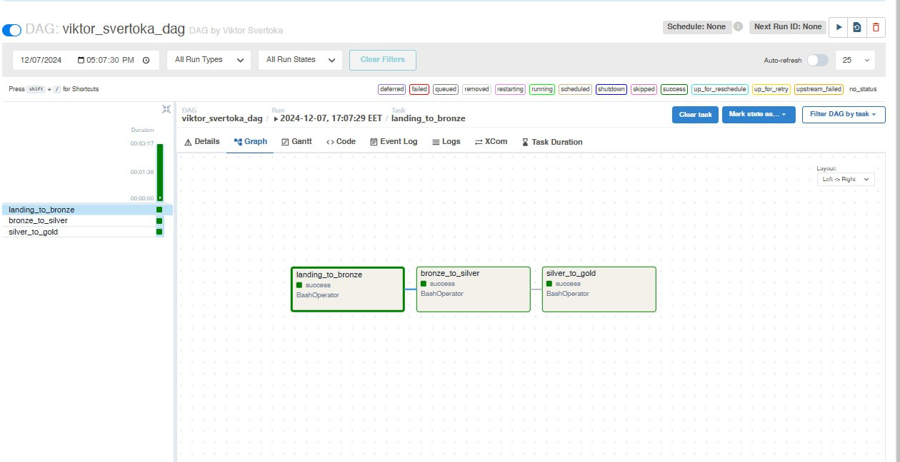

# Фінальний проєкт з курсу

# Частина 1. Building an End-to-End Streaming Pipeline

## Покрокова інструкція виконання

> [!NOTE]
>
> 👉🏻 Отже, ви вже знаєте умови завдання. Висвітлимо їх докладніше.

Ви працюєте в букмекерській конторі. Одне з ваших завдань — генерація даних для
ML-моделей. Деякі з features — це середній зріст, середня вага, стать, країна
походження атлетів.

Моделі тренуються окремо для кожного виду спорту. Дані про наявність медалі у
виступі використовуються як target (output) для ML-моделі.

Фірма хоче коригувати коефіцієнти ставок якомога швидше, тому вас попросили
розробити відповідне рішення з використанням стримінгу. Фізичні дані атлетів
відомі заздалегідь і зберігаються в MySQL базі даних. Результати змагань же
подаються через Kafka-топік.

Ваша задача:

1. Зчитати дані фізичних показників атлетів за допомогою Spark з MySQL таблиці
   `olympic_dataset.athlete_bio` (база даних і Credentials до неї вам будуть
   надані).

2. Відфільтрувати дані, де показники зросту та ваги є порожніми або не є
   числами. Можна це зробити на будь-якому етапі вашої програми.

3. Зчитати дані з результатами змагань з Kafka-топіку `athlete_event_results`.
   Дані з json-формату необхідно перевести в dataframe-формат, де кожне поле
   json є окремою колонкою.

4. Об’єднати дані з результатами змагань з Kafka-топіку з біологічними даними з
   MySQL таблиці за допомогою ключа `athlete_id`.

5. Знайти середній зріст і вагу атлетів індивідуально для кожного виду спорту,
   типу медалі або її відсутності, статі, країни (`country_noc`). Додайте також
   timestamp, коли розрахунки були зроблені.

6. Зробіть стрим даних (за допомогою функції `forEachBatch`) у:

а) вихідний кафка-топік,

b) базу даних.

Вигляд вихідних даних має бути приблизно таким:

## Критерії прийняття та оцінювання

- Код виконується та надає бажаний результат.
- Наведено скриншоти, що демонструють результат роботи коду методом виведення на
  екран чи/та в базу даних.

> [!IMPORTANT]
>
> За умови виконання всіх завдань достатньо скриншотів тільки бази даних та
> принта даних з Kafka-топіку (не потрібні скриншоти проміжних етапів).

У коді коментарями позначено, де саме відбувається виконання кожного етапу
завдання. Наприклад, `# Етап 6.а): запис у вихідний Kafka-топік`.

> [!TIP]
>
> ☝🏻 Критерії прийняття фінального проєкту є обов’язковою умовою його оцінювання
> ментором. Якщо якийсь із критеріїв не виконано, ментор відправить завдання на
> доопрацювання без оцінювання. Якщо вам «тільки уточнити»😉 або ви
> застопорилися на якомусь з етапів виконання — звертайтеся до ментора у Slack).

#### Загальна максимальна кількість балів — 50:

- Етап 1 оцінюється в 10 балів.
- Етап 2 оцінюється у 5 балів.
- Етап 3 оцінюється в 10 балів.
- Етап 4 оцінюється у 5 балів.
- Етап 5 оцінюється у 5 балів.
- Етап 6 оцінюється у 15 балів (7 за стрим у вихідний Kafka-топік і 8 у базу
  даних).

> [!CAUTION]
>
> Якщо є помилки чи недоліки виконання, кількість балів на кожному етапі
> зменшується пропорційно до наявних помилок на розсуд ментора.

# Частина 2. Building an End-to-End Batch Data Lake

## Покрокова інструкція виконання

> [!NOTE]
>
> 👉🏻 Нагадаємо суть завдання

У цій частині проєкту ви створите простий multi-hop datalake, який
використовуватиме інструменти обробки даних, такі як Spark, для роботи з даними
та організації ETL-процесів (Extract, Transform, Load).

Задача буде схожа до тої, яку ви розв’язували в першому фінальному проєкті, але
цього разу ви будете працювати з батчами даних, що є критично важливим для
будь-якої Data Engineering системи.

У ході виконання завдання ви будете працювати з уже відомими вам даними про
атлетів та їхні спортивні результати. Це таблиці `athlete_bio` та
athlete_event_results, які знаходяться на FTP-сервері за адресами
https://ftp.goit.study/neoversity/athlete_bio.txt і
https://ftp.goit.study/neoversity/athlete_event_results.txt відповідно.

Основне завдання полягає в побудові трирівневої архітектури обробки даних: від
початкового збереження (landing zone), через оброблені та очищені дані
(bronze/silver), до фінального аналітичного набору (gold).

Ваша задача:

1. Написати файл `landing_to_bronze.py`. Він має:

- завантажувати файл з ftp-сервера в оригінальному форматі csv,
- за допомогою Spark прочитати csv-файл і зберегти його у форматі parquet у
  папку `bronze/{table}`, де `{table}` — ім’я таблиці.

2. Написати файл `bronze_to_silver.py`. Він має:

- зчитувати таблицю bronze,
- виконувати функцію чистки тексту для всіх текстових колонок,
- робити дедублікацію рядків,
- записувати таблицю в папку `silver/{table}`, де `{table}` — ім’я таблиці.

3. Написати файл `silver_to_gold.py`. Він має:

- зчитувати дві таблиці: `silver/athlete_bio` та `silver/athlete_event_results`,
- робити join за колонкою `athlete_id`,
- для кожного значення `sport`, `medal`, `sex`, `country_noc` знаходити середні
  значення `weight і height`,
- додати колонку `timestamp` з часовою міткою виконання програми, записувати
  дані в `gold/avg_stats`.

4. Написати файл `project_solution.py`, де буде знаходитись Airflow DAG, який
   послідовно запускатиме всі три файли.

## Критерії прийняття та оцінювання

- Код виконується та надає бажаний результат.
- Наведено скриншоти, що демонструють результат роботи коду (скриншоти таблиць
  виведення та скриншот графу відпрацьованого DAGу).

> [!TIP]
>
> ☝🏻 Критерії прийняття фінального проєкту є обов’язковою умовою його оцінювання
> ментором. Якщо якийсь із критеріїв не виконано, ментор відправить завдання на
> доопрацювання без оцінювання. Якщо вам «тільки уточнити»😉 або ви
> застопорилися на якомусь з етапів виконання — звертайтеся до ментора у Slack).

#### Загальна максимальна кількість балів — 50:

- Етап 1 оцінюється у 15 балів.
- Етап 2 оцінюється у 15 балів.
- Етап 3 оцінюється в 10 балів.
- Етап 4 оцінюється в 10 балів. Якщо є помилки чи недоліки виконання, кількість
  балів на кожному етапі зменшується пропорційно до наявних помилок на розсуд
  ментора.

## Підготовка й завантаження фінального проєкту

1. Створіть публічний репозиторій goit-de-fp.

2. Виконайте обидві частини проєкту та відправте у свій репозиторій файли з
   кодом та скриншоти результатів роботи у текстовому файлі.

> [!IMPORTANT]
>
> 💡 Для частини 1 фінального проєкту:
>
> За умови виконання всіх завдань достатньо скриншотів тільки бази даних і
> принта даних з Kafka-топіку (не потрібні скриншоти проміжних етапів).

> [!WARNING]
>
> 💡 Для частини 2 фінального проєкту:

Фінальний DataFrame для кожної Spark job виведіть на екран командою `df.show()`,
де `df` — це ваш DataFrame. Результат з’явиться в логах відповідних run і
taks-run.

Для того, щоб до них дістатися, клікніть на значок відповідного taks-run (зліва
виділено червоним) і на Logs (справа виділено червоним).

Прогорніть до того моменту, коли знайдете виведення на екран датафрейму. Зробіть
скриншот приблизно так, як показано на цьому малюнку. Має також бути видно
часову мітку (стовпчик зліва в синьому прямокутнику).

Достатньо зробити скриншот виведення для однієї будь-якої таблиці для кожної
Spark job. Відповідно маєте отримати три такі скриншоти.

Також зробіть скриншот графу відпрацьованого DAGу.

3. Створіть один архів, що містить усі файли з кодом виконання завдання, та
   текстовий документ із скриншотами, прикріпіть його в LMS. Назва архіву
   повинна бути у форматі ФП_ПІБ.

4. Прикріпіть посилання на репозиторій `goit-de-fp` і відправте на перевірку.

## Формат здачі

- Посилання на репозиторій `goit-de-fp`.
- Прикріплений архів із назвою ФП_ПІБ.

## Фінальний проєкт з курсу Data Engineering

### Результати виконаного завдання № 1

#### Запис даних у таблицю MySQL

#### Запис даних у Kafka-топік

### Результати виконаного завдання № 2

#### Запис даних у таблицю bronze

#### Запис даних у таблицю silver

#### Запис даних у таблицю gold

#### DAG з усіма відпрацьованими завданнями

